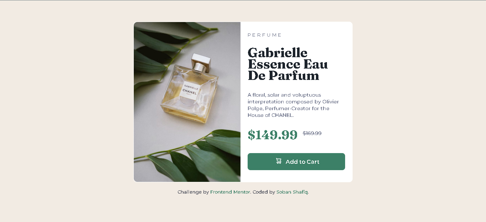

# Frontend Mentor - Product preview card component solution

This is a solution to the [Product preview card component challenge on Frontend Mentor](https://www.frontendmentor.io/challenges/product-preview-card-component-GO7UmttRfa). Frontend Mentor challenges help you improve your coding skills by building realistic projects. 

## Table of contents

- [Overview](#overview)
  - [The challenge](#the-challenge)
  - [Screenshot](#screenshot)
  - [Links](#links)
- [My process](#my-process)
  - [Built with](#built-with)
  - [What I learned](#what-i-learned)
  - [Continued development](#continued-development)
  - [Useful resources](#useful-resources)
- [Author](#author)


## Overview

### **The challenge:**

Users should be able to:

- View the optimal layout depending on their device's screen size
- See hover and focus states for interactive elements

### **Screenshot:**




### **Links**

- Solution URL: [To be added](https://your-solution-url.com)
- Live Site URL: [To be added](https://your-live-site-url.com)

## My process

### **Built with**

- Semantic HTML5 markup
- CSS custom properties
- Flexbox


### **What I learned **

- How to use media queries.
- How to use the flexbox's row or column axis.
- Usage of rem unit in CSS.

```css
@media screen and (max-width: 375px) {}
```
```css
 #container{
   display: flex;
   flex-direction: row;
    }
```
```css
.title{
      font-family: 'Fraunces';
      font-size: 2.3rem;
      line-height: 2.0rem;
    }
```

### **Continued development**

- I am still learning best practices to implement media queries, since the webpage is not fully responsive yet.
- It does show the mobile version on a smaller screen but on some of the screen breakpoints the layout turns into a mess.


### **Useful resources**

- [W3Schools](https://www.w3schools.com/css/css3_mediaqueries.asp) - This helped me in understanding syntax and usage of media queries. The examples provided alongwith the documentation cleared out some confusions I had.


## Author

- GitHub - [Soban Shafiq](https://github.com/the-soban)
- Frontend Mentor - [@the-soban](https://www.frontendmentor.io/profile/the-soban)
- Twitter - [@the_soban3](https://www.twitter.com/the_soban3)
